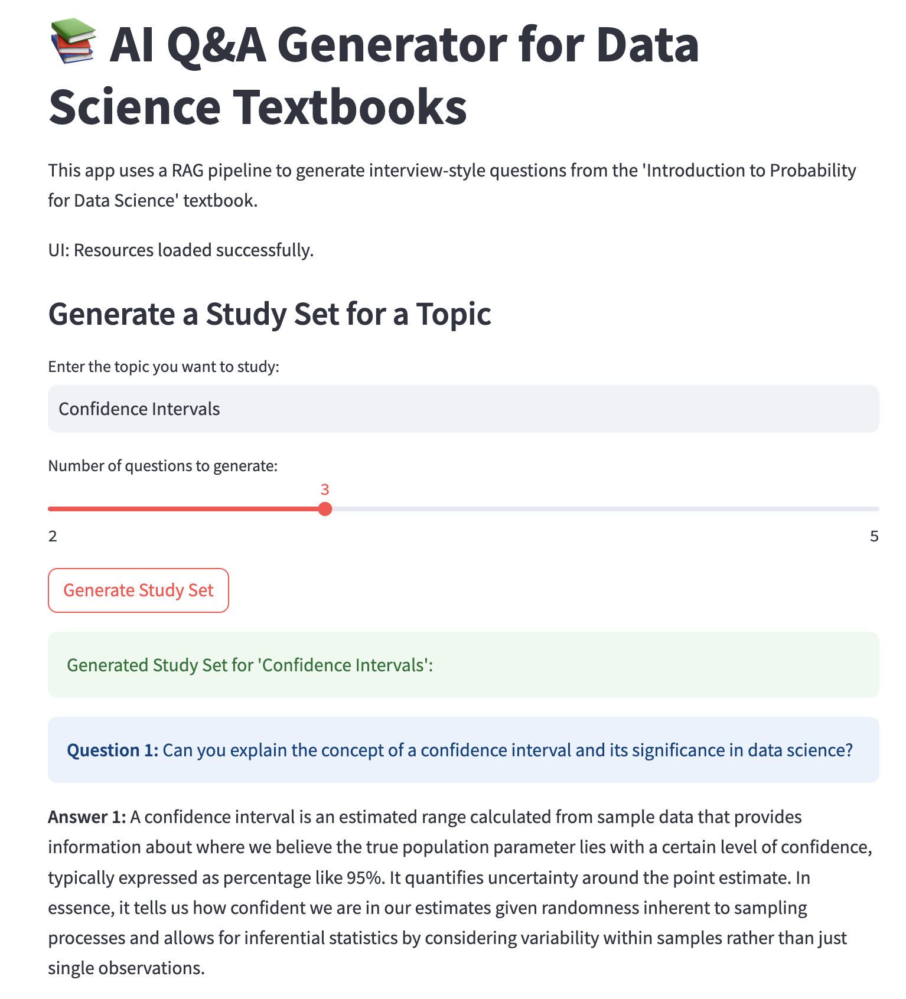

# 📚 AI Q&A Generator for Data Science Textbooks

This project is an AI-powered system that ingests specific chapters from data science textbook PDF, understands its content, and generates high-quality, interview-style questions and answers. It features a Retrieval-Augmented Generation (RAG) pipeline running entirely on a local machine.

## ✨ Features

- **Advanced PDF Parsing:** Uses the Nougat model to convert complex scientific PDFs into structured Markdown, accurately preserving text and LaTeX formulas.
- **Retrieval-Augmented Generation (RAG):** Implements an end-to-end RAG pipeline to ensure answers are grounded in the textbook's content.
- **Local & Private:** Runs entirely on a local machine using Ollama and a quantized Phi-3 model, ensuring privacy and zero API costs.
- **Two Generation Modes:**
  - **Single Q&A:** Ask a specific question and get a context-aware answer.
  - **Topic Study Sets:** Provide a topic (e.g., "ROC Curve") and get a set of interview questions to prepare with.
- **Interactive UI:** A simple and intuitive web interface built with Streamlit.

## 🚀 Demo



## 🛠️ Technology Stack & Architecture

- **Language:** Python
- **PDF Parsing:** Meta's Nougat (`facebook/nougat-small`)
- **LLM:** Microsoft's Phi-3 Mini (`phi3:mini-4k`) via Ollama
- **Embeddings:** `all-MiniLM-L6-v2` via `sentence-transformers`
- **Vector Store:** ChromaDB (local persistent storage)
- **UI:** Streamlit
- **Core Libraries:** PyMuPDF, Transformers, PyTorch, LangChain (for text splitting)

### Architecture Flow
1.  A chapter-specific PDF is processed by **Nougat** into a structured Markdown file.
2.  The Markdown is chunked, preserving metadata, and each chunk is converted into a vector embedding using **Sentence-Transformers**.
3.  These embeddings and chunks are stored in a **ChromaDB** vector store.
4.  When a user provides a query via the **Streamlit** UI, it is embedded and used to search **ChromaDB** for the most relevant context chunks (Retrieval).
5.  The retrieved context is formatted into a detailed prompt and sent to the local **Phi-3 LLM** via **Ollama**.
6.  The LLM generates a Q&A pair based *only* on the provided context (Generation).

## ⚙️ Setup & Installation

Follow these steps to set up and run the project locally.

**1. Prerequisites:**
- Python 3.10+
- [Ollama](https://ollama.ai/) installed on your machine.
- [Homebrew](https://brew.sh/) (on macOS for installing Tesseract).

**2. Clone the Repository:**
```bash
git clone https://github.com/ds-sharvari-jadhav/ds_textbook_qa_generator.git
cd ds_textbook_qa_generator
```

**3. Set Up Environment & Dependencies:**
```bash
# Create and activate a virtual environment
python3 -m venv venv
source venv/bin/activate

# Install required Python packages
pip install -r requirements.txt
```

**4.Set Up Local LLM:**
ollama pull phi3:mini-4k

### 5. Prepare Data (One-Time Setup):

This is a multi-step, automated process that builds the vector database from your textbook PDF. It ingests the source PDF, processes it with Nougat, chunks the content, generates embeddings, and populates the database. This entire pipeline can take over an hour to run depending on your machine's performance.

-   Place your textbook PDF (e.g., `"Introduction to Probability for Data Science.pdf"`) in the project's **root directory**.
-   **Important:** Before running, you must open the relevant data processing scripts in the `src/` folder (e.g., `01b_split_chapter_pdf.py`, etc.) and configure the necessary variables inside them (like file paths and chapter page numbers).
-   Run the following commands from the project's **root directory** in the specified order:

```bash
# Step 1: Split the PDF to the target chapter
python3 src/01b_split_chapter_pdf.py

# Step 2: Process the chapter with Nougat (this will take a long time)
python3 src/01d_nougat_parser_pdf.py

# Step 3: Chunk the markdown, generate embeddings, and populate the database
python3 src/03_embedding_vectorstore.py
```
After these scripts complete successfully, a chroma_db_nougat_chapter9/ folder containing the knowledge base will be created.

# 🚀 Usage
Once the vector database has been built, launch the Streamlit web application from the project's root directory:
```bash
streamlit run src/app.py
```
Open your web browser to the local URL provided by Streamlit (usually http://localhost:8501).
